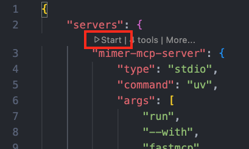
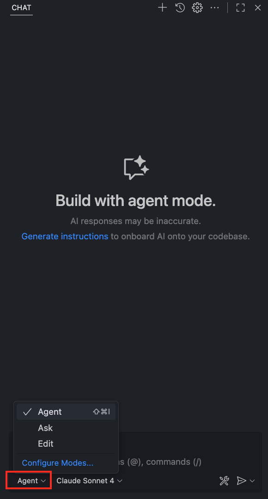
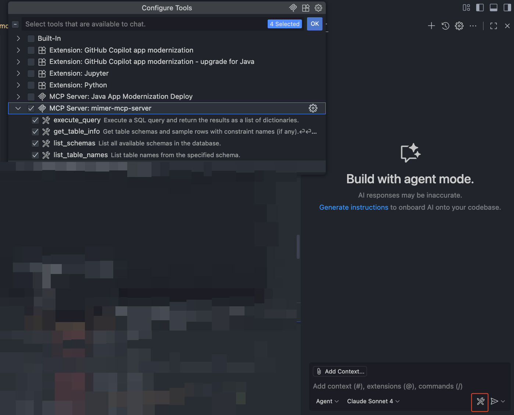
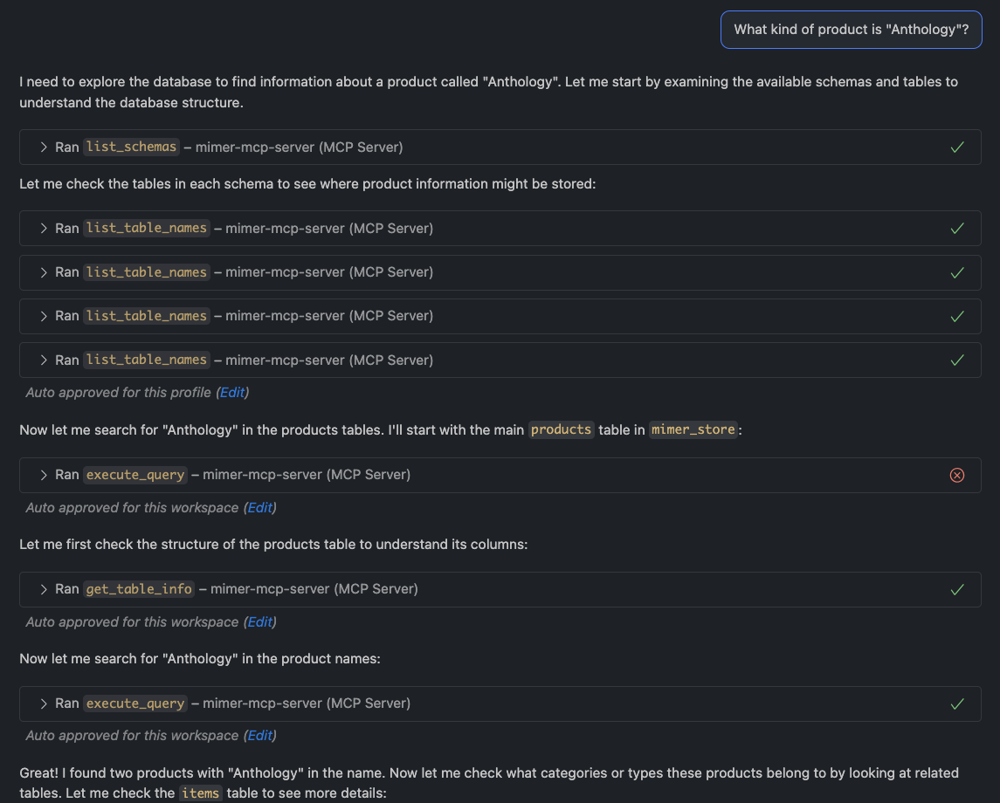
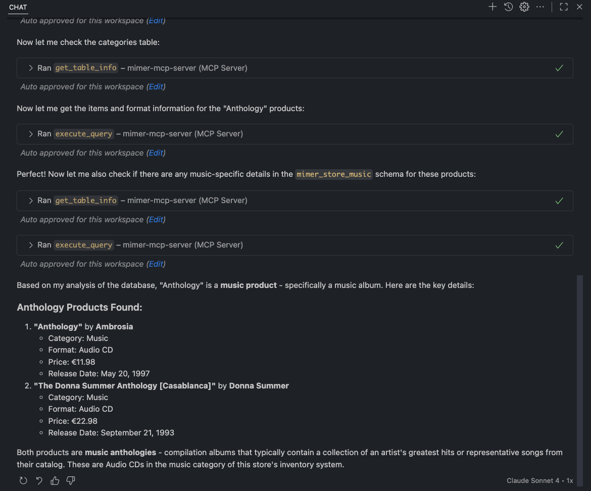

# Mimer MCP Server

A Model Context Protocol (MCP) server that provides Mimer SQL database connectivity to browse database schemas, execute read-only queries with parameterization support, and manage stored procedures.

<!-- mcp-name: io.github.mimersql/mimer-mcp -->

## Available Tools

### Database Schema Tools
- `list_schemas` — List all available schemas in the database
- `list_table_names` — List table names within the specified schema
- `get_table_info` — Get detailed table schema and sample rows

### Query Execution Tools
- `execute_query` — Execute SQL query with parameter support (Only SELECT queries are allowed)

### Stored Procedure Tools
- `list_stored_procedures` — List read-only stored procedures in the database
- `get_stored_procedure_definition` — Get the definition of a stored procedure
- `get_stored_procedure_parameters` — Get the parameters of a stored procedure
- `execute_stored_procedure` — Execute a stored procedure in the database with JSON parameters

## Getting Started

### Prerequisites
- Python 3.10 or later (with uv installed) _or_ Docker
- Mimer SQL 11.0 or later

---

### Environment Configuration

Before running the server, you need to configure your database connection settings using environment variables. The Mimer MCP Server reads these from a `.env` file.

Mimer MCP Server can be configured using environment variables through `.env` file with the following configuration option:

| Environment Variable | Default | Description |
|---------------------|---------|-------------|
| `DB_DSN` | *Required* | Database name to connect to |
| `DB_USER` | *Required* | Database username |
| `DB_PASSWORD` | *Required* | Database password |
| `DB_HOST` | - | Database host address (use `host.docker.internal` for Docker) |
| `DB_PORT` | `1360` | Database port number |
| `DB_PROTOCOL` | `tcp` | Connection protocol |
| `DB_POOL_INITIAL_CON` | `0` | Initial number of idle connections in the pool |
| `DB_POOL_MAX_UNUSED` | `0` | Maximum number of unused connections in the pool |
| `DB_POOL_MAX_CON` | `0` | Maximum number of connections allowed (0 = unlimited) |
| `DB_POOL_BLOCK` | `false` | Determines behavior when exceeding the maximum number of connections. If `true`, block and wait for a connection to become available; if `false`, raise an error when maxconnections is exceeded |
| `DB_POOL_DEEP_HEALTH_CHECK` | `true` | If `true`, validates connection health before getting from pool (slower but more reliable) |
| `MCP_LOG_LEVEL` | `INFO` | Logging level for the MCP server. Options: `DEBUG`, `INFO`, `WARNING`, `ERROR`, `CRITICAL` |

## Usage with VS Code

MCP servers are configured using a JSON file (`mcp.json`). Different MCP hosts may have slightly different configuration formats. In this guide, we'll focus on VS Code as an example. First, ensure you've installed the latest version of VS Code and have access to Copilot.

One way to add MCP server in VS Code is to add the server configuration to your workspace in the `.vscode/mcp.json` file. This will allow you to share configuration with others.

1. Create a `.vscode/mcp.json` file in your workspace.
2. Add the following configuration to your `.vscode/mcp.json` file, depending on how you want to run the MCP server.


### Option 1: Using Docker (Recommended)

#### Option 1.1: Build the Docker Image Locally

```bash
docker build -t mimer-mcp-server .
```

Then, add the following configuration to `.vscode/mcp.json` file

```json
{
	"servers": {
		"mimer-mcp-server": {
			"command": "docker",
			"args": [
				"run",
				"-i",
				"--rm",
				"--add-host=host.docker.internal:host-gateway",
				"--env-file=/absolute/path/to/.env",
				"mimer-mcp-server",
			]
		}
	},
	"inputs": []
}
```

#### Option 1.2: Use the Pre-Built Image from Docker Hub

```json title="mcp.json"
{
    "servers": {
        "mimer-mcp-server": {
            "command": "docker",
            "args": [
                "run",
                "-i",
                "--rm",
                "--add-host=host.docker.internal:host-gateway",
                "--env-file=/absolute/path/to/.env",
                "mimersql/mimer-mcp:latest"
            ]
        }
    },
    "inputs": []
}
```

### Option 1.3: Use Docker compose and the official Mimer SQL docker container

This will start a Mimer SQL Docker container as well as the mimer-mcp-server container,
set up a private network between the two containers and create the Mimer SQL example database.
The Mimer SQL database will be stored in the docker volume called `mimer_mcp_data` so that database changes are persistent.

```
{
  "servers": {
    "mimer-mcp-server": {
      "command": "docker",
      "args": [
        "compose",
        "run",
        "--rm",
        "-i",
        "--no-TTY",
        "mimer-mcp-server"
      ]
    }
  },
  "inputs": []
}
```

### Option 2: Using uv

[](vscode:mcp/install?%7B%22name%22%3A%22mimer-mcp-server%22%2C%22type%22%3A%22stdio%22%2C%22command%22%3A%22uv%22%2C%22args%22%3A%5B%22run%22%2C%22--with%22%2C%22fastmcp%22%2C%22fastmcp%22%2C%22run%22%2C%22%2Fabsolute%2Fpath%2Fto%2Fserver.py%22%5D%7D)

```json
{
	"servers": {
		"mimer-mcp-server": {
			"type": "stdio",
			"command": "uvx",
			"args": [
				"mimer_mcp_server"
			],
			"env": {
				"DOTENV_PATH": "/absolute/path/to/.env"
			}
		}
	}
}
```

3. After saving the configuration file, VS Code will display a **Start** button in the `mcp.json` file. Click it to launch the server.



5. Open Copilot Chat and in the Copilot Chat box, select Agent mode from the dropdown.



6. Select the Tools button to view the list of available tools. Make sure the tools from Mimer MCP Server are selected.



7. Enter a prompt in the chat input box and notice how the agent autonomously selects a suitable tool, fix errors and generate a final answer from gathered queries results. (Following examples use the Example Database from Mimer, which is owned by MIMER_STORE. Read more about this database: [here](https://developer.mimer.com/article/the-example-database/))





## Development 

### Prerequisites
- Python: 3.10+
- [uv](https://github.com/astral-sh/uv): for dependency management and running the server
- Mimer SQL 11.0 or later
- Node.js and npm: for debugging with MCP inspector

#### Install `uv`:
```bash
# macOS / Linux
curl -LsSf https://astral.sh/uv/install.sh | sh

# or via Homebrew
brew install uv
```

Verify installation:
```bash
uv --version
```

#### Install Node.js and npm:
```bash
# Linux (Ubuntu/Debian)
sudo apt install nodejs npm

# macOS (via Homebrew)
brew install node
```

Verify installation:
```bash
node --version
npm --version
```

### Getting Started
1. Clone the repository

2. Create and activate a virtual environment
```bash
uv venv

# macOS / Linux
source .venv/bin/activate
# Windows
.venv\Scripts\activate
```

3. Install dependencies from pyproject.toml
```bash
uv sync
```

4. Configure environment variables
```bash
cp .env.example .env
# Edit .env with your database credentials
```
The configuration is loaded automatically via `config.py`.

### Debug with MCP inspector

MCP Inspector provides a web interface for testing and debugging MCP Tools (Requires Node.js: 22.7.5+):
```bash
npx @modelcontextprotocol/inspector
```

Note: MCP Inspector is a Node.js app and the npx command allows running MCP Inspector without having to permanently install it as a Node.js package. 

Alternatively, you can use FastMCP CLI to start the MCP inspector
```bash
uv run fastmcp dev /absolute/path/to/server.py
```

To run the Mimer SQL docker image and mimer-mcp-server using Docker compose, run:
```bash
MCP_TRANSPORT=http docker compose up
```

or to run it as a daemon:
```bash
MCP_TRANSPORT=http docker compose up -d
```
This way it is possible to call the mimer-mcp-server using HTTP and port 3333.