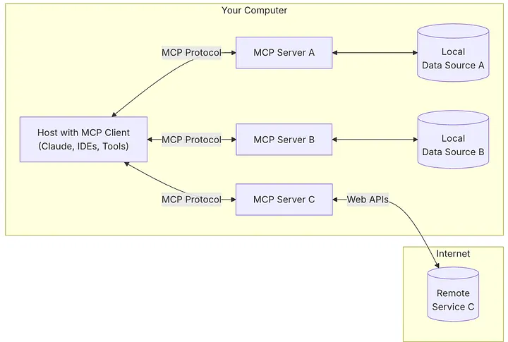

---
hide:
  - navigation
---

# Introduction

Mimer MCP Server is a tool for developers, data engineers, and database administrators building AI applications that need secure database connectivity. It integrates with AI applications through the Model Context Protocol (MCP), enabling natural language database interactions without sacrificing security or requiring SQL expertise from end users.

## What is MCP?

The Model Context Protocol (MCP) is an open protocol that allows AI applications to connect and interact with external tools and data sources. It enables AI to access information beyond its training data, improving its ability to access real-world data and perform tasks.

The **MCP architecture** consists of three key participants:

* **MCP Host**: The AI application that coordinates and manages one or multiple MCP clients (e.g., VS Code, Claude Desktop, Cursor).
* **MCP Client**: A component that maintains a connection to an MCP server and obtains context from an MCP server for the MCP host to use.
* **MCP Server**: A program that provides context to MCP clients and exposes specific capabilities—like the Mimer MCP Server.

<figure markdown="span">
  
  <figcaption>Image Source: <a href="https://modelcontextprotocol.io/docs/learn/architecture">MCP official website</a></figcaption>
</figure>

!!! note

    MCP server refers to the program that serves context data, regardless of where it runs. MCP servers can execute locally or remotely.

## Why MCP Matters

MCP provides a standardized way for AI applications to connect to external systems, offering several key advantages over custom integrations:

|  | Without MCP (Custom Integration) | With MCP |
|--|------------|-----------|
| Integration Effort | Custom code for each AI application and data source combination | Single MCP server works with any MCP-compatible host |
| Standardization | Each integration uses different conventions and patterns | Standardized protocol for discovery, execution, and communication |
| Discovery | Static configuration or hardcoded capabilities | Dynamic capability negotiation and real-time updates via notifications |
| Maintenance | Update integration code in every AI application when APIs change | Update once in MCP server; all connected clients benefit automatically |
| Security & Authentication | Implemented separately for each integration | Standardized transport layer with consistent authentication patterns |
| Developer Experience | Learn different APIs and patterns for each integration | Learn once, use everywhere with consistent SDK patterns |
| Connection Management | Connection handling left to AI application logic | Centralized connection pooling managed by MCP server |

### Database Access through MCP

When AI applications connect to databases through MCP, they gain capabilities that fundamentally transform data interaction:

|  | AI Without Database Access | AI With Database Access (via MCP) |
|--|------------|-----------|
| SQL Generation | LLMs generate raw SQL without schema knowledge (often incorrect) | LLMs use tools to query with validated SQL and guardrails |
| Schema Discovery | Users must manually describe table structures in prompts | AI auto-discovers schemas, tables, and procedures dynamically |
| Stored Procedures | AI cannot access or leverage existing business logic | AI can discover and execute existing stored procedures |

## Mimer MCP Server

### Overview
--8<-- "docs/mimer-mcp-server/index.md:overview"

### Tools Overview
--8<-- "docs/mimer-mcp-server/tools.md:overview"

See [Available Tools documentation](mimer-mcp-server/tools.md#available-tools) for further details on tools' descriptions, example prompts, and return values.

---

## Real-World Application Scenarios

### Business Analytics

Business users can query databases using natural language without requiring a data analyst to write SQL queries. For example:

- `"Show me sales trends for the last quarter"`
- `"Which customers have placed orders over $1000?"`
- `"What are our top-selling products?"`

The AI agent then handles schema discovery, query generation, and summerize the results to the users.

### Business Intelligence Integration

Database administrators can expose specific stored procedures to AI applications, allowing them to:

- Run pre-approved analytical queries
- Access computed metrics and KPIs
- Maintain consistent business logic across applications

This read-only access ensures that AI agents cannot accidentally modify or delete data, providing peace of mind for production deployments.

!!! tip 

    See [Examples documentation](mimer-mcp-server/examples.md) on how business users can query Mimer's Example Database using natural langauge without writing SQL queries.