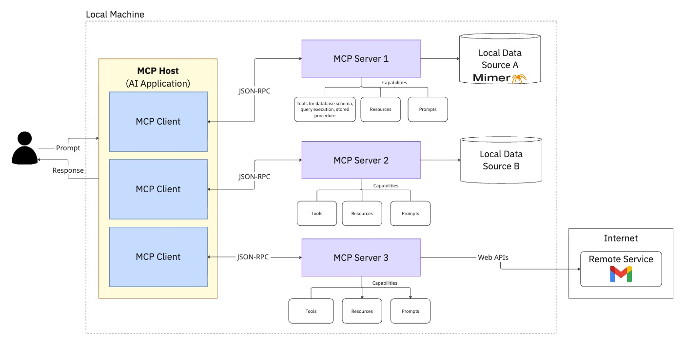

# Mimer MCP Server

## Overview
<!-- --8<-- [start:overview] -->
The diagram below shows how AI applications interact with Mimer SQL through the Mimer MCP Server. The MCP host (such as VS Code with GitHub Copilot) connects to the Mimer MCP Server through an MCP client, which then communicates with your Mimer SQL database using standard database protocols.

<figure markdown="span">
  
  <figcaption>The landscape of MCP clients (VS Code, Claude, Cursor) connecting to the Mimer MCP Server, which interfaces with Mimer SQL databases</figcaption>
</figure>

The architecture provides clear separation of concerns:

- **AI Layer**: Natural language understanding and tool selection
- **MCP Layer**: Standardized protocol for tool discovery and invocation
- **Database Layer**: Secure, validated database operations

This separation ensures that security policies are enforced at the server level, database credentials are centrally managed, and AI agents cannot perform destructive operations.
<!-- --8<-- [end:overview] -->

---

## Database Connection Management

The Mimer MCP Server manages database connections efficiently through a connection pool that is initialized when the server starts, maintained throughout its lifetime, and properly closed when the server shuts down. Each tool follows this connection lifecycle:

1. **Acquires a connection** from the pool when the tool is invoked
2. **Executes** the database operation using the acquired connection
3. **Returns the connection** back to the pool automatically after execution completes

This ensures optimal resource utilization and prevents connection exhaustion.

---
